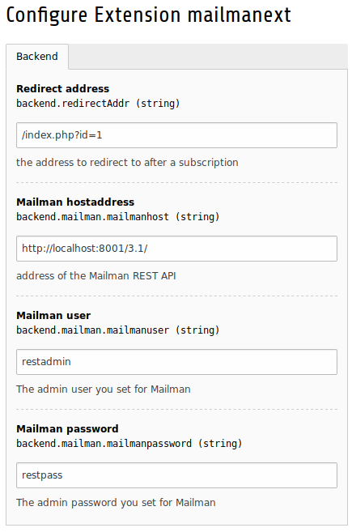

=======================
Quick Start Guide
=======================

After the installation of this extension go to **ADMIN TOOLS** in your TYPO3 Backend. Next, click on **Extensions** and search **mailmanext**. You should see the Mailman Extension.

Before the extension can show any Mailinglists, you need to go to into the configuration of the Extension and set the Value for Redirect address, the Mailman hostaddress, the Mailman user and your Mailman password. This will allow to redirect the user to any link you specify after Subscription and to communicate with the REST-API of your mailman installation.

|extension_conf|

Per Default, this Extension will take the mail currently active in your front end data ($GLOBALS['TSFE']->fe_user->user['email']). If you need to get the email data from somewere else, you need to change lines **25** , **26** , **38** , **39** , **59** and **60** in typo3conf/ext/mailmanext/Classes/Controller/MailmanExtController and replace $GLOBALS['TSFE']->fe_user->user['email'] with the source of the email you want to be used.

Add the plugin to the desired page and follow the instructions in the tab **plugin configuration** 
to add the mailinglists you want displayed. The selected mailinglists should now be displayed on your page.
To change the information displayed by the plugin follow the instructions for **template editing**

