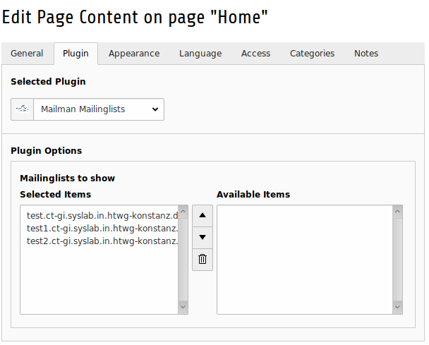

====================
Plugin Configuration
====================

After you added the Plugin to a page you should select the mailinglist you want the user to see. To do this, go to the Page and edit the Plugin, now select the lists you want the user to see. 

|pluginsetting|

